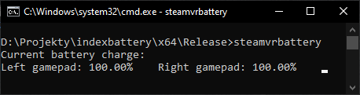

## steamvrbattery
Basic CLI SteamVR/OpenVR gamepad battery display.

SteamVR doesn't have a way of dispalying gamepad's battery percentage without putting on the headset which is why this utility was made.



### Requirements
- Windows or Linux 64-bit
- Visual C++ 2022 redists on Windows
- SteamVR open in background

### CLI arguments
- `--help` or `-?` : Shows help prompt
- `--interval <miliseconds>` or `-i <miliseconds>` : Changes battery charge display update interval (default 1000ms)
- `--verbose` or `-v` : Enables verbose output

### Troubleshooting
```
./steamvrbattery: error while loading shared libraries: libopenvr_api.so: cannot open shared object file: No such file or directory
```
Copying the OpenVR library binary to `/usr/local/lib` should fix the error:
```bash
sudo cp libopenvr_api.so /usr/local/lib/
sudo ldconfig
```

### Building
#### Windows:
Built and tested with Visual C++ 2022

Open the solution file in Visual Studio and build it from that or open the clone directory in Visual C++ command prompt and run `msbuild`

Compiled program will be in `x64\Debug` or `x64\Release` directory
#### Linux:
Built and tested with G++ 6.3.0

Run `build_linux64.sh` bash script and the compiled program will be in `out/` directory

### License
steamvrbattery is [MIT licensed](https://github.com/copperpixel/steamvrbattery/blob/master/LICENSE).